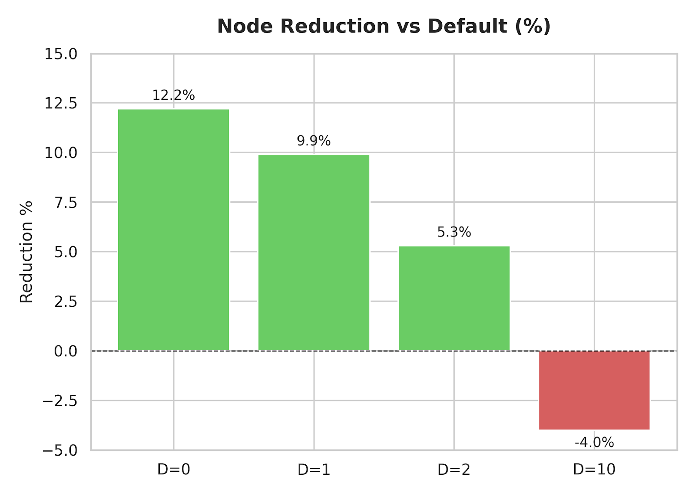
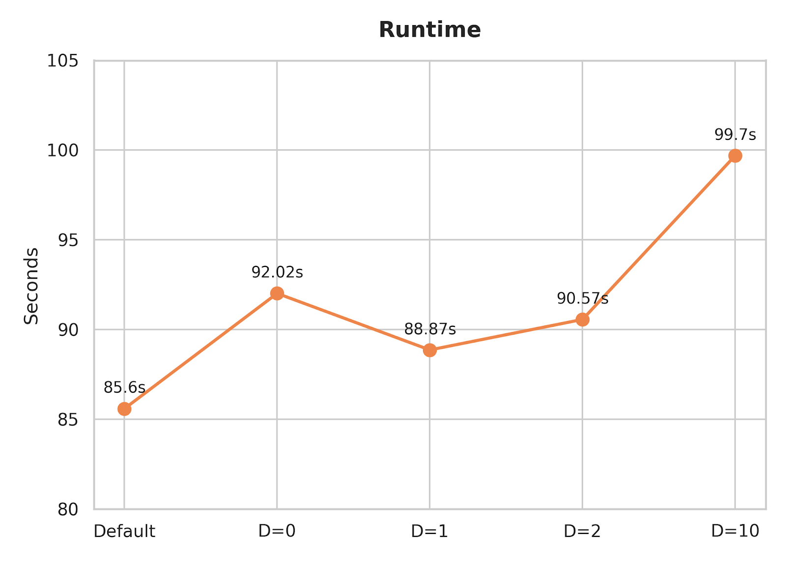
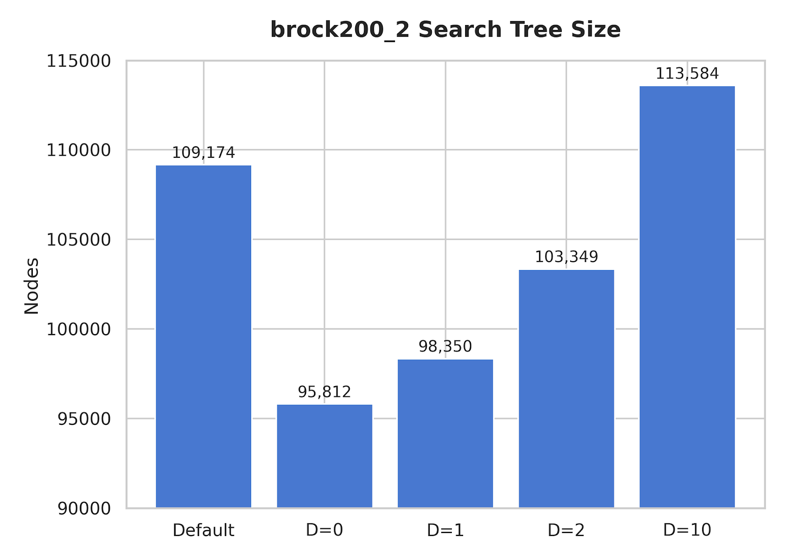
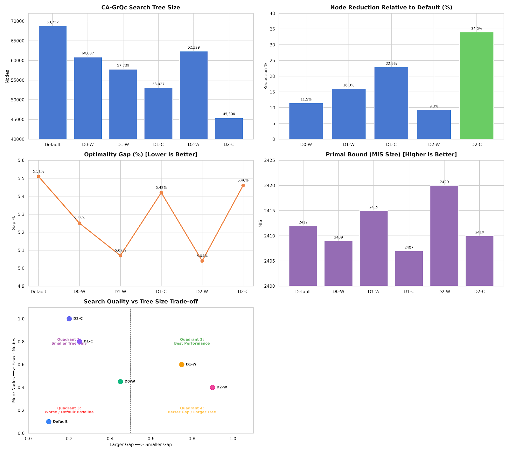
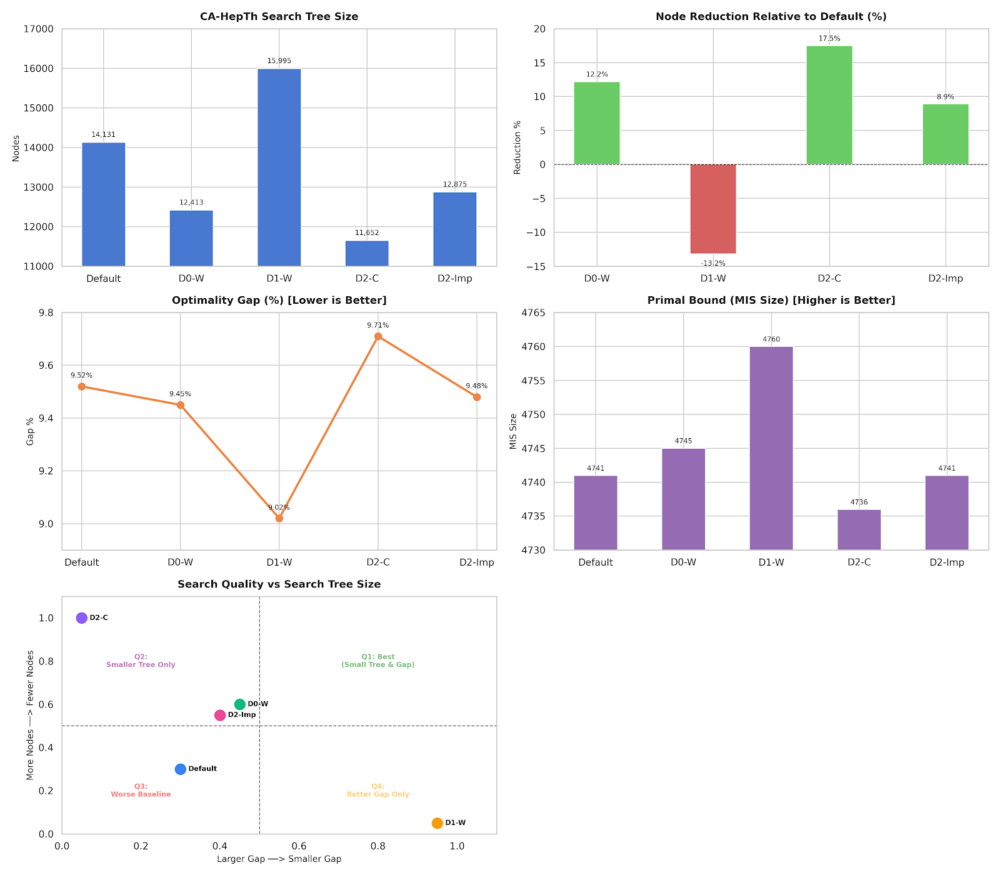
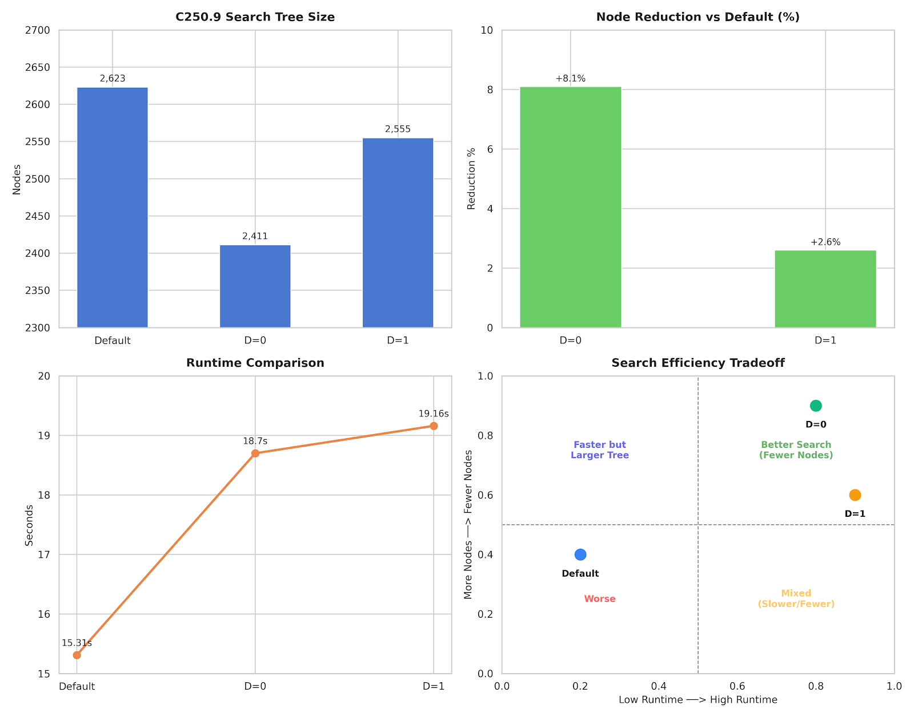
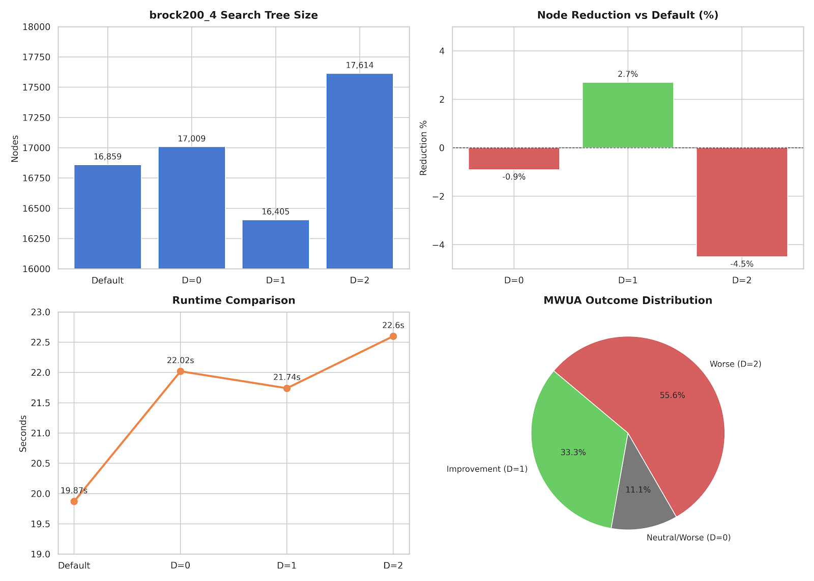
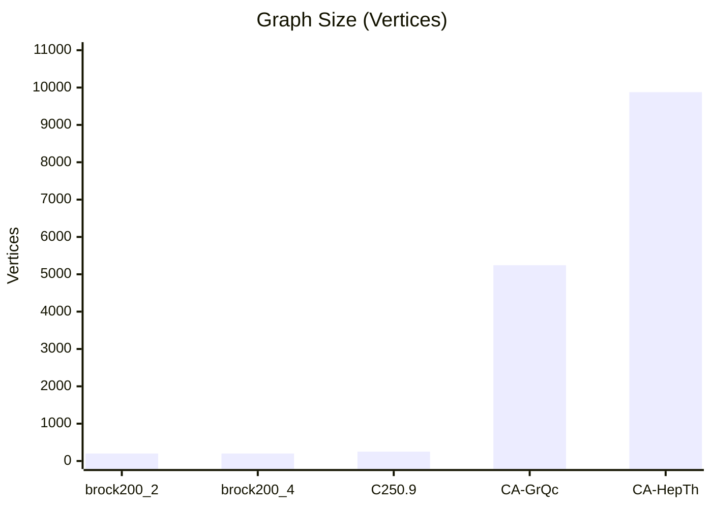
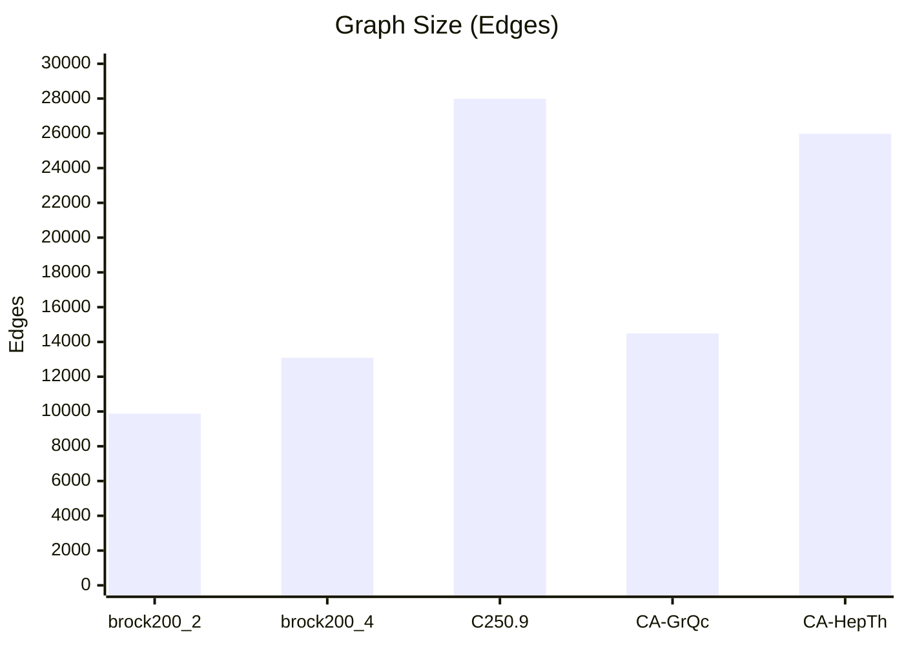

# MWUA-Guided Branching for Maximum Independent Set

## Experimental Setup

**Solver Configuration**

* SCIP Branch-and-Bound
* Presolve OFF
* Heuristics OFF
* Separating OFF

All experiments were conducted with SCIP's auxiliary components disabled to isolate the effect of the branching rule.

**MWUA Scoring Variants**

* **Weighted Score:** `0.5 · x_avg + 0.5 · weight_avg`
* **Certainty Score:** `|x_avg - 0.5|`

**Depth Parameter**

* `D=0`: MWUA used only at the root node
* `D=1`: MWUA used up to depth 1
* `D=2`: MWUA used up to depth 2

---

## Results Summary

| Instance   | Best Variant | Main Outcome              |
| ---------- | ------------ | ------------------------- |
| brock200_2 | D=0 Weighted | 12.2% fewer nodes         |
| brock200_4 | D=1 Weighted | 2.7% fewer nodes          |
| C250.9     | D=0 Weighted | 8.1% fewer nodes          |
| CA-GrQc    | D=2 Weighted | Best primal bound and gap |
| CA-HepTh   | D=1 Weighted | Best primal bound and gap |

---

## Key Findings

### 1. MWUA Is Most Effective Near the Root

  

Across most benchmarks, the strongest improvements were obtained when MWUA guidance was restricted to the upper levels of the search tree (`D=0–2`).

  

Increasing the depth of MWUA influence beyond the early branching decisions generally provided little additional benefit and occasionally increased search effort.

  

### 2. Weighted and Certainty Scores Exhibit Different Behaviors

Two distinct branching behaviors emerged:

**Weighted MWUA**

* Improved primal solution quality.
* Reduced optimality gaps.
* Guided SCIP toward more promising search regions.

**Certainty-Based MWUA**

* Produced substantially smaller search trees.
* Reduced node counts by up to 34%.
* Did not consistently improve primal bounds or gaps.

### 3. MWUA Improves Search Quality on Large Real-World Networks

For the largest benchmark instances:

**CA-GrQc**

* Primal: 2412 → 2420
* Gap: 5.51% → 5.04%

  

**CA-HepTh**

* Primal: 4741 → 4760
* Gap: 9.52% → 9.02%

  

These improvements suggest that MWUA influences not only tree size but also the quality of explored search regions.

### 4. Performance Is Instance Dependent

  

The impact of MWUA varies across graph families:

* Consistent improvements on DIMACS benchmarks.
* Stronger effects on large sparse real-world networks.
* Optimal depth settings depend on graph structure.

  

---

# Benchmark Instances

| Instance   | Type                          | Vertices |  Edges | Status     |
| ---------- | ----------------------------- | -------: | -----: | ---------- |
| brock200_2 | DIMACS Clique Benchmark       |      200 |  9,876 | Solved     |
| brock200_4 | DIMACS Clique Benchmark       |      200 | 13,089 | Solved     |
| C250.9     | DIMACS Random Graph Benchmark |      250 | 27,984 | Solved     |
| CA-GrQc    | SNAP Collaboration Network    |    5,242 | 14,484 | Time Limit |
| CA-HepTh   | SNAP Collaboration Network    |    9,877 | 25,973 | Time Limit |

## Graph Size Comparison

The benchmark set spans more than an order of magnitude in graph size, ranging from small DIMACS benchmarks (200–250 vertices) to large real-world collaboration networks containing thousands of vertices.

### Vertices

### Edges

### Size Distribution by Graph Family

| Family             | Instances                      | Vertex Range | Edge Range    |
| ------------------ | ------------------------------ | ------------ | ------------- |
| DIMACS             | brock200_2, brock200_4, C250.9 | 200–250      | 9,876–27,984  |
| SNAP Collaboration | CA-GrQc, CA-HepTh              | 5,242–9,877  | 14,484–25,973 |

## Motivation

The benchmark suite intentionally combines:

* Classical DIMACS hard instances.
* Large sparse real-world collaboration networks.
* Solved and time-limited search scenarios.

This allows evaluation of MWUA-guided branching across both synthetic benchmark graphs and realistic network structures.
